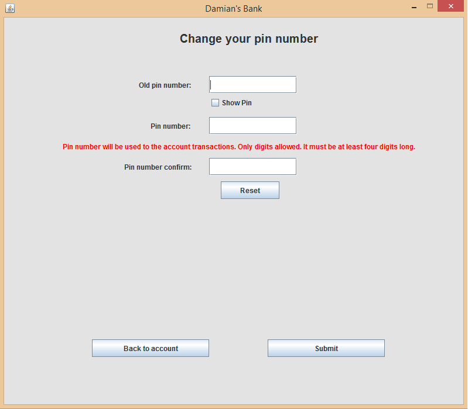

## Table of contents
* [General info](#general-info)
* [Inspiration](#inspiration)
* [Application idea](#application-idea)
* [Technologies](#technologies)
* [Screenshots](#screenshots)
* [Setup](#setup)

## General info
This project is a client for Bank RESTful application: https://github.com/damian12321/bank
	
## Inspiration
The program was created for my own needs because I wanted to use something else than Postman to test my previous application.

## Application idea
The program includes a simple graphical user interface.
There are two separate windows for normal user and administrator.
Normal user has a possibility to create account, login, change information about the account and perform banking operations.
The administrator has access to all information in the bank such as customers and accounts list, latest transactions.

## Technologies
Project is created with:
* Java
* Maven

## Screenshots





## Setup
Clone the repo from github:
```
$ git clone https://github.com/damian12321/bank-client
```
You can run the application on your favourite IDE by running src/main/java/client/mainApp/BankClient.main
or by command line in the application root folder.

```
$ mvn clean compile assembly:single
$ java -jar target/bank-client-1.0.0-jar-with-dependencies.jar
```

