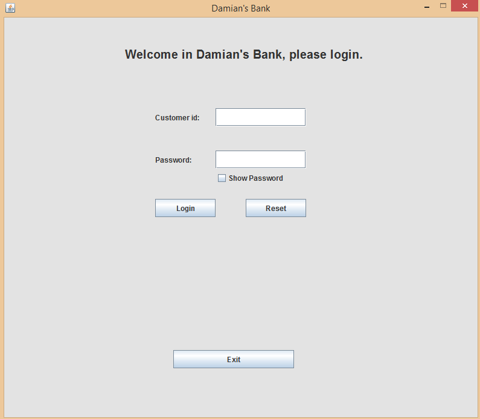

## Table of contents
* [General info](#general-info)
* [Application idea](#application-idea)
* [Technologies](#technologies)
* [Screenshots](#screenshots)
* [Setup](#setup)

## General info
This project is a client for Bank RESTful application: https://github.com/damian12321/bank
	
## Application idea
The program includes a simple graphical user interface.
User has a possibility to login, change pin number and perform banking operations.
Instead of a physical credit card, client can log in to the application using your customer number and password.

## Technologies
Project is created with:
* Java
* Maven

## Screenshots



## Setup
Clone the repo from github:
```
$ git clone https://github.com/damian12321/bank-client
```
You can run the application on your favourite IDE by running src/main/java/client/mainApp/BankClient.main
or by command line in the application root folder.

```
$ mvn clean compile assembly:single
$ java -jar target/bank-client-1.0.0-jar-with-dependencies.jar
```


